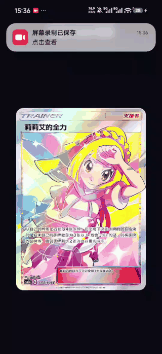

# Flutter Holo Card Skill ✨

让一张普通卡图在 Flutter 里“活”起来：轻轻拖动，前景浮起、背景退后，彩虹镭射沿着卡面流动，人物轮廓也会跟着亮起来。小时候舍不得买的闪卡，现在可以自己搓啦。

## 先看效果

[](docs/demo.mp4)

> 点击动图可播放原视频。GitHub 首页会直接展示动态预览，不用先下载再脑补效果。

## 它会闪出什么

- 前景与背景会产生反向视差，卡面看起来更有纵深。
- 彩虹镭射、斜向扫光和细碎星芒会随观察角度流动，不是简单换几个颜色。
- 人物可见轮廓会泛起柔和高光，让主体更“跳”出卡面。
- 小幅拖动也能带动材质、扫光、轮廓和景深，适合 App 中克制的卡片倾角。
- 按住、拖动、松手的过渡保持连贯，卡片会自然回正。
- 背景和前景两层就能完成效果，不需要把人物单独拆成第三个移动图层。

## 让 AI 帮你安装

不想自己搬文件？把下面这段完整复制给 Codex，它会自己找到门牌号：

```text
请使用 $skill-installer 从 GitHub 安装这个 Codex Skill：

仓库：https://github.com/2912826201/flutter-holo-card-skill.git
Skill 路径：skills/build-flutter-holo-card

请将它安装到当前用户的 Codex Skills 目录。若同名 Skill 已存在，不要直接覆盖，先告诉我并询问如何处理。安装完成后，请验证 SKILL.md 与 agents/openai.yaml，并告诉我该 Skill 会从下一轮对话开始可用。
```

## 手动安装

把 `skills/build-flutter-holo-card` 放进 Codex 的 Skills 目录：

```text
~/.codex/skills/build-flutter-holo-card
```

## 开始做卡

安装完成后新开一轮对话，附上卡图，然后直接说：

```text
使用 $build-flutter-holo-card，把这张图做成 Flutter 全息卡。
```

Skill 会准备卡片资源，并给出可接入 Flutter 项目的组件、`CustomPainter` 与 Runtime Shader。示例模板在 `skills/build-flutter-holo-card/assets/flutter`，资源处理脚本在 `skills/build-flutter-holo-card/scripts`。

## 本地验证

```bash
python -m pip install -r requirements.txt
python -m unittest discover -s tests

cd skills/build-flutter-holo-card/assets/flutter
flutter pub get
flutter analyze lib test
flutter test
```

## 致谢 💫

本项目参考了 [LerSent001/holo-card](https://github.com/LerSent001/holo-card) 的图层视差、轮廓光与全息材质思路，并把它实现为 Flutter Runtime Shader 版本。

为了让工作流更适合通用图片生成环境，这个 Flutter 版本收敛了生成范围，去掉了补绘被遮挡主体、恢复隐藏细节等更容易触发安全策略拒绝的环节。感谢原项目把这套闪闪发光的想法开源出来。

## License

代码与文档使用 [MIT License](LICENSE)。演示视频由用户提供，视频中的卡面、美术、角色、商标与其他第三方内容仍归各自权利方所有。
