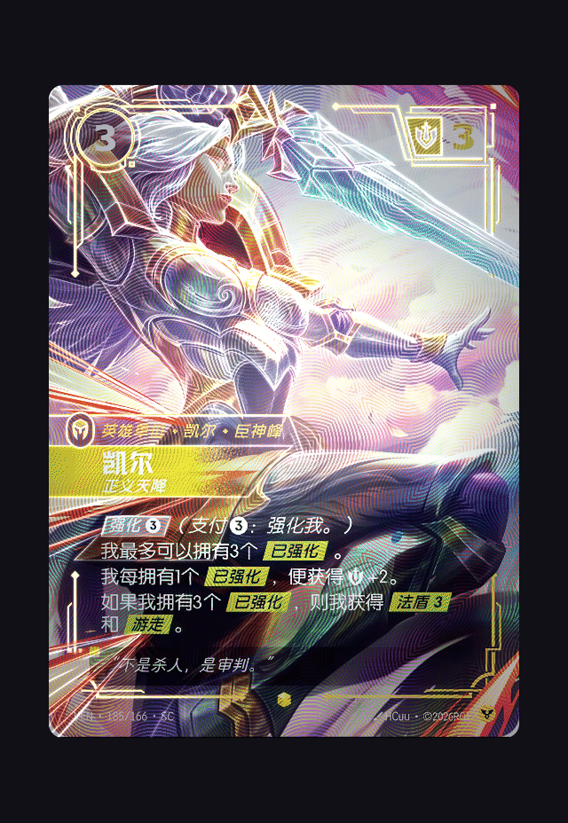

# Flutter Holo Card Skill

将静态卡图制作成随视角变化的 Flutter 全息卡。提供 `height`、`medium`、`low` 三档效果；Demo 可以调节参数，并导出当前组件或完整工程。

[在线 Demo](https://2912826201.github.io/flutter-holo-card-skill/) · [下载完整 Demo](https://github.com/2912826201/flutter-holo-card-skill/releases/download/demo-2026-09-23/holo-demo.zip) · [查看 Demo 源码](examples/holo_demo)

移动鼠标或拖动卡片可查看角度变化；也可以切换档位、调整光效。

## 效果预览

### height · 立体全息

前景留在卡面，背景随视角移动，主体轮廓在反光经过时亮起。



### medium · 轮廓反射

使用完整原图，人物、装备和卡框的轮廓随角度反光。


### low · 纯镭射

保留原图，让彩虹箔纹和眩光随视角变化。


## 实现原理

三档共用一套箔光材质：片段着色器根据卡面坐标和指针位置叠加两层彩虹反光、箔纹及眩光。`low` 直接在原图上渲染。`medium` 增加一张前景线稿，转换成轮廓与柔光贴图，让高光沿主体轮廓移动。`height` 再用透明前景和补全的背景分层；卡片转动时，通过背景平面投影产生视差，前景与文字仍留在原位。

素材准备和实时渲染分开进行。`height` 需要前景、背景和线稿，`medium` 只需要线稿，`low` 只使用原图。运行时由 Flutter 加载图片与 GLSL Shader，再通过 `FragmentProgram`、`FragmentShader` 和 `CustomPainter` 绘制；鼠标与拖动输入控制角度。Demo 使用 Dart 在浏览器本地打包 ZIP，导出时保存当前档位与参数。

项目主要使用 Flutter/Dart、Flutter RuntimeEffect Shader、Python、Pillow、NumPy 和 PyYAML。实现细节和资源要求见 [Skill 说明](skills/build-flutter-holo-card/SKILL.md)。

## 安装 Skill

复制下面整段，发给支持 Skill 的 AI 编程助手：

```text
请从 https://github.com/2912826201/flutter-holo-card-skill/tree/main/skills/build-flutter-holo-card 安装 Skill，只安装完整的 build-flutter-holo-card 目录。使用 Codex 时装到 $CODEX_HOME/skills（未设置则 ~/.codex/skills）；其他工具使用各自的个人 Skills 目录。保留 SKILL.md、scripts/、references/ 和 assets/。如果已有同名目录，先检查差异，不要直接覆盖。安装后确认 SKILL.md 可读取，并给我一个调用 $build-flutter-holo-card 的示例。
```

提供卡图并指定 `height`、`medium` 或 `low`，即可只制作对应档位。未指定档位时，默认交付可切换三档的 Flutter Web Demo；只需要图片资源时，可加上 `assets-only`。

材质来源和许可见[第三方说明](THIRD_PARTY_NOTICES.md)。
