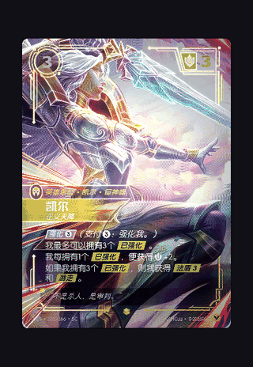
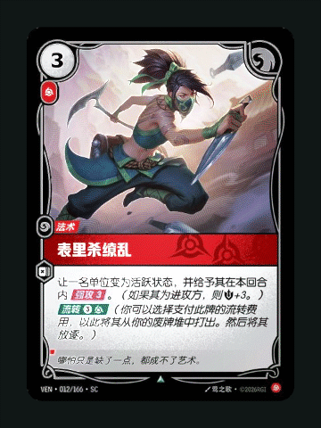
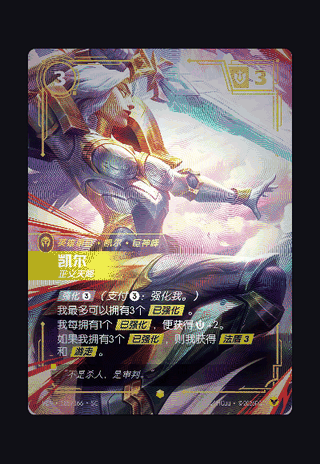

# Flutter Holo Card Skill

把原始卡图制作为 Flutter 全息卡，支持三个可明确指定的方案。完整示例见 [天鹅 EX 演示](examples/tianxiang_card/README.md)。

| 指令 | 彩色资源 | 内部景深 | 前景轮廓光 |
|---|---|---|---|
| `height`（默认） | 原色前景＋补全延展背景 | 背景后退，前景固定 | 有 |
| `medium` | 完整原图 | 无 | 有 |
| `low` | 完整原图 | 无 | 无 |

三档共用参考项目的双向彩虹、箔纹和眩光，支持悬停、拖动、连续回正、受控姿态和关闭整卡倾斜。height 的背景使用 8% 延展区和中立校准投影，所有层共用源图 Alpha 边界；不再使用 160% 出框画布。景深范围 0–3，默认 1，负值需要迁移。

## 三档拖动效果对比

同一张卡、相同拖动轨迹，松手后连续回正。以下 GIF 来自 Flutter 组件的实际触摸事件与逐帧渲染，非 AI 生成动画。

| height · 景深＋轮廓反射 | medium · 轮廓反射 | low · 纯镭射 |
| :---: | :---: | :---: |
|  |  |  |
| 留意人物后方屋檐与天空的相对移动 | 留意武器、人物和卡框上扫过的亮线 | 没有额外描线，也没有内部视差 |

轮廓默认强度已从 **0.35 调高至 0.55**。三档光效强度均为 0.65；height 演示使用后退距离 2、背景移动强度 3（组件默认仍为 1 / 1）。GIF 采用 256 色压缩，细线和渐变以交互预览为准；此录制不代表真机性能测试。

[阿卡丽三档示例](examples/akali_card/README.md) · [动图复现方法](docs/previews/README.md)

## 使用

安装 `skills/build-flutter-holo-card` 到 Skills 目录，再安装其 requirements.txt 中的 Python 依赖。

```text
使用 $build-flutter-holo-card，height，把这张卡集成到 Flutter 项目。
使用 $build-flutter-holo-card，medium，保留原图，只加前景轮廓与镭射。
使用 $build-flutter-holo-card，low，asset-only。
```

`asset-only` 独立于档位。low 不调用生图；height/medium 的轮廓均从原图提取，不重画文字。height 才生成未知背景，并回填原图已知背景像素。

```dart
HolographicCard.low(cardImage: const AssetImage('assets/card/source.png'))
```

其他构造、集成与迁移说明见 [渲染契约](skills/build-flutter-holo-card/references/rendering-contract.md)。组件使用通用 ImageProvider，默认关闭自动展示；图片失败显示原图并报告错误，不静默降档。

## 质量流程

`normalize_source.py` → 所选档位的遮罩审查 → `asset_pipeline.py build` → 实际视觉审查 `review` → `check_assets.py` → `integrate_flutter.py`。low 跳过遮罩步骤。候选文件不等于已验收；manifest 将输入、方案、上游报告、图片和视觉证据绑定 SHA-256。失败重试撤下旧候选，诊断和旧截图保留。

```bash
python -m pip install -r requirements.txt
python -m unittest discover -s tests
cd skills/build-flutter-holo-card/assets/flutter
flutter pub get
flutter analyze
flutter test
```

演示 Web 构建：在 `examples/tianxiang_card` 执行 `flutter build web --no-web-resources-cdn`。浏览器检查、Flutter Widget/raster 测试和真机验证分别记录，不混用结论。

## 许可

脚本与文档采用 [MIT](LICENSE)。复用参考材质的 Flutter 包按 GPL-3.0 分发，完整许可、来源与箔纹随包附带，详见 [第三方说明](THIRD_PARTY_NOTICES.md)。这些许可不授予卡图、角色和商标权利。
